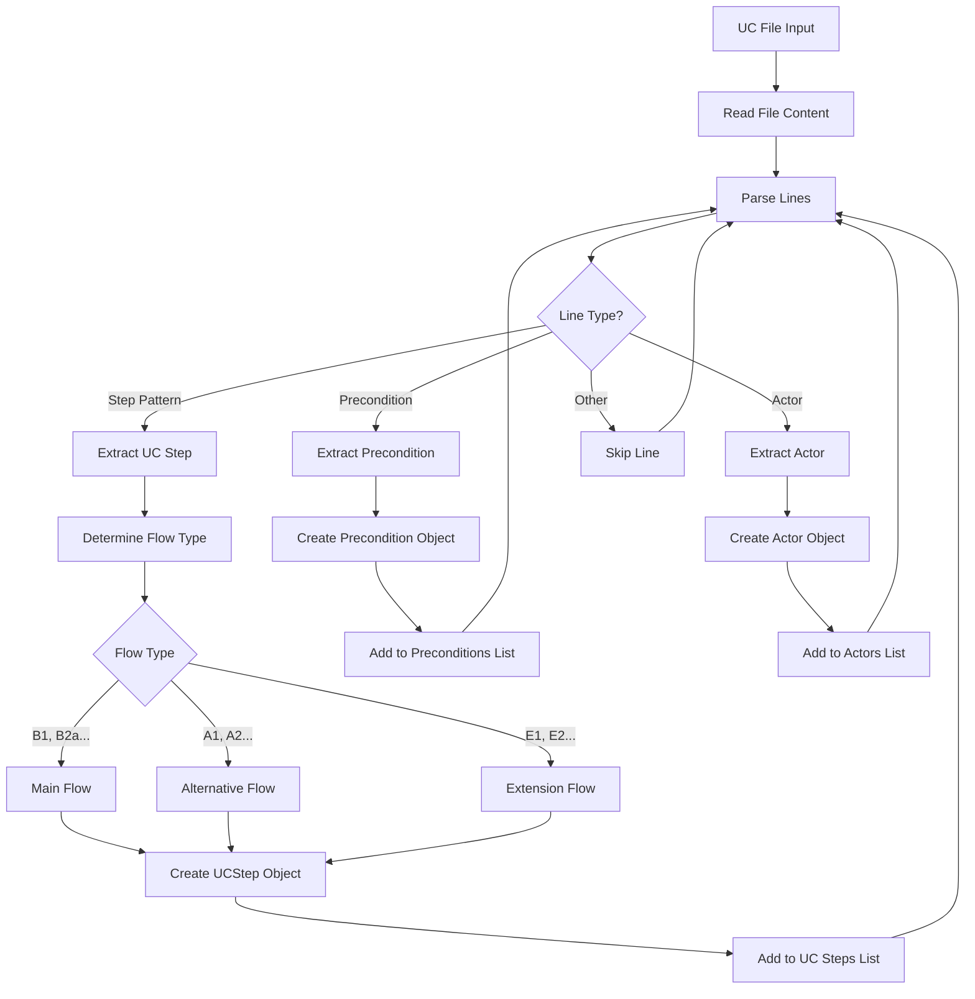
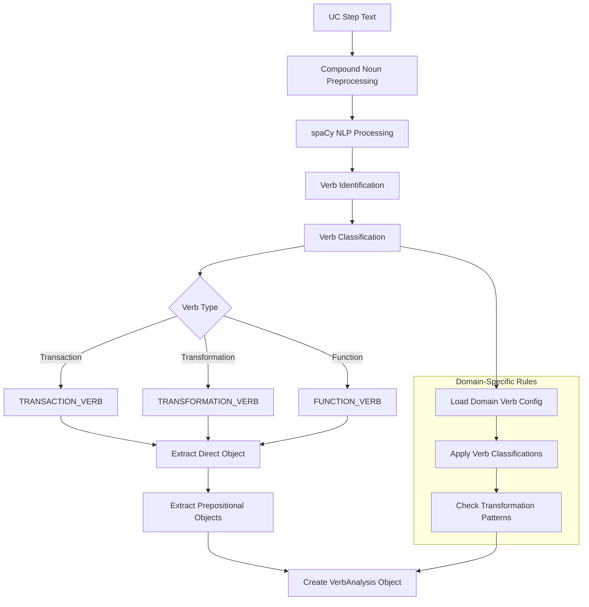
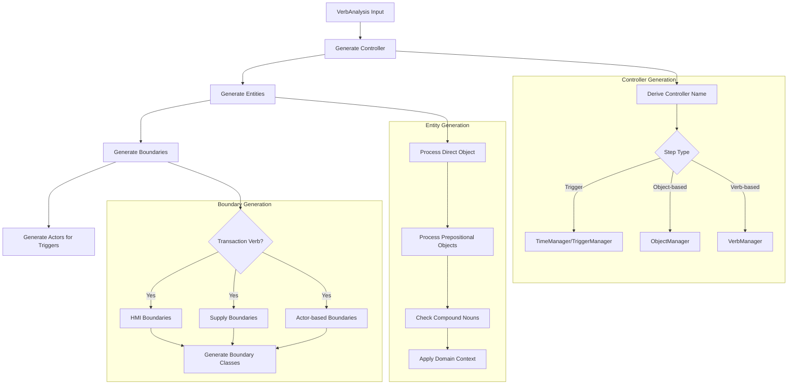
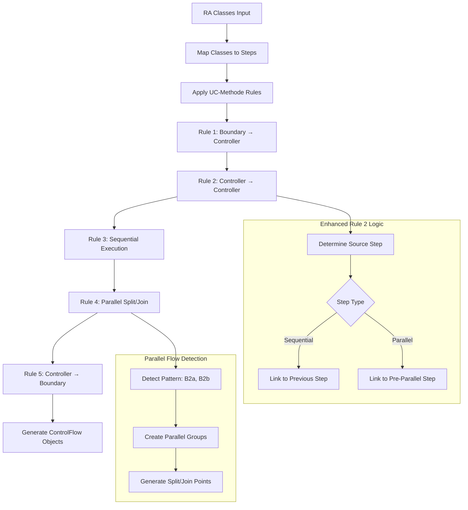

# Generic UC Analyzer - Ablaufdiagramm

## Überblick
Der `generic_uc_analyzer.py` implementiert eine systematische 5-Phasen UC-Methode Robustheitsanalyse für beliebige Use Cases aus beliebigen Domänen.

## Hauptablauf

```mermaid
flowchart TD
    A[Start: analyze_uc_file] --> B[Parse UC File]
    B --> C{UC Steps gefunden?}
    C -->|Nein| Z[Return [], []]
    C -->|Ja| D[Domain Detection]
    
    D --> E[Analyze UC Steps]
    E --> F[Validate Actors]
    F --> G[Return verb_analyses, ra_classes]
    
    subgraph "Parse UC File (_parse_uc_file)"
        B1[Read File Content]
        B2[Extract UC Steps]
        B3[Extract Preconditions]
        B4[Extract Actors]
        B1 --> B2 --> B3 --> B4
    end
    
    subgraph "Domain Detection (_detect_domain_from_steps)"
        D1[Analyze Step Keywords]
        D2[Match Domain Patterns]
        D3[Load Domain Configuration]
        D1 --> D2 --> D3
    end
    
    subgraph "Analyze UC Steps (_analyze_uc_steps)"
        E1[NLP Preprocessing]
        E2[Sentence Verb Analysis]
        E3[Generate RA Classes]
        E4[Control Flow Analysis]
        E5[Data Flow Analysis]
        E6[UC-Methode Validation]
        E1 --> E2 --> E3 --> E4 --> E5 --> E6
    end
    
    B --> B1
    D --> D1
    E --> E1
```

## Detaillierter Ablauf - Phase für Phase

### Phase 1: UC File Parsing


### Phase 2: NLP Preprocessing & Verb Analysis


### Phase 3: RA Class Generation


### Phase 4: Control Flow Analysis (UC-Methode Rules)


### Phase 5: Data Flow Analysis (Enhanced Preposition Semantics)
```mermaid
flowchart TD
    D1[VerbAnalysis + Entities] --> D2[Analyze Direct Objects]
    D2 --> D3[Analyze Prepositional Objects]
    D3 --> D4[Apply Preposition Rules]
    
    D4 --> D5{Preposition Type}
    D5 -->|"with", "from", "using"| D6[USE Relationship]
    D5 -->|"to", "into", "for"| D7[PROVIDE Relationship]
    D5 -->|"in"| D8[Context-dependent]
    
    D6 --> D9[Create DataFlow: Controller → Entity (USE)]
    D7 --> D10[Create DataFlow: Controller → Entity (PROVIDE)]
    D8 --> D11[Analyze Context]
    D11 --> D9
    D11 --> D10
    
    subgraph "Multiple Data Flows per Step"
        D12[Collect All USE Entities]
        D13[Collect All PROVIDE Entities]
        D14[Generate Separate DataFlow Objects]
        D12 --> D14
        D13 --> D14
    end
    
    D9 --> D12
    D10 --> D13
    
    subgraph "Enhanced CSV Export"
        D15[One Row per RA Class per DataFlow]
        D16[Include Control Flow Info]
        D17[Include Data Flow Details]
        D14 --> D15 --> D16 --> D17
    end
```

### Phase 6: Validation & Output
```mermaid
flowchart TD
    V1[Analysis Results] --> V2[UC-Methode Validation]
    V2 --> V3[Actor Usage Validation]
    V3 --> V4[Implementation Element Check]
    V4 --> V5[Generate Warnings]
    
    V5 --> V6[Output Generation]
    V6 --> V7[JSON Export]
    V6 --> V8[Enhanced CSV Export]
    V6 --> V9[RA Diagram Generation]
    
    subgraph "Validation Rules"
        V10[Rule 1: Actors ≠ Entities]
        V11[Rule 2: All Actors Used]
        V12[Rule 3: All Step Actors Declared]
        V13[Implementation Element Warnings]
        V10 --> V11 --> V12 --> V13
    end
    
    subgraph "Enhanced CSV Structure"
        V14[UC_Schritt | Schritt_Text | RA_Klasse]
        V15[Control_Flow_Source | Control_Flow_Type]
        V16[Data_Flow_Entity | Data_Flow_Type]
        V17[Multiple Rows per Multiple Flows]
        V14 --> V15 --> V16 --> V17
    end
    
    V2 --> V10
    V8 --> V14
```

## Key Features & Improvements

### 1. **Domain-Agnostic Analysis**
- Automatische Domain-Erkennung basierend auf UC-Inhalten
- Konfigurierbare Domain-spezifische Verb-Klassifikationen
- Universal einsetzbar für beliebige Domänen

### 2. **Enhanced UC-Methode Rules**
- **Rule 1**: Boundary generation für Actor + Transaction Verb
- **Rule 2**: Verbesserte Controller-Controller Flows mit Parallel-Handling
- **Rule 3-5**: Vollständige UC-Methode Compliance

### 3. **Advanced Data Flow Semantics**
- **Before Preposition** → USE relationship
- **After Preposition** → PROVIDE relationship
- Multiple USE/PROVIDE entities pro UC Step

### 4. **Comprehensive Output**
- JSON with complete analysis metadata
- Enhanced CSV with Control + Data Flows
- RUP-compliant RA diagrams
- Multi-UC integration support

## Datenstrukturen

### Input
- **UC File**: Text-basierte Use Case Beschreibung
- **Domain Config**: JSON-basierte Verb-Klassifikationen
- **Preconditions**: Betriebsmittel-Vorbedingungen

### Output
- **VerbAnalysis[]**: Verb-Klassifikationen mit Objekten
- **RAClass[]**: Vollständige RA-Klassen (Actor, Boundary, Controller, Entity)
- **ControlFlow[]**: UC-Methode Rule-compliant Control Flows
- **DataFlow[]**: Preposition-based Entity Relationships
- **JSON**: Strukturierte Analyse-Ergebnisse
- **Enhanced CSV**: Multi-Flow Traceability

## Performance & Skalierung
- spaCy NLP für effiziente Textverarbeitung
- Modulare Domain-Konfigurationen
- Parallel-verarbeitungsfähig für Multi-UC Szenarien
- Optimierte Flow-Generation für große UC-Sammlungen